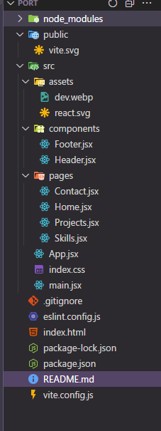

# 🚀 Personal Portfolio - MERN Stack Developer

A modern, responsive personal portfolio website built with React and Tailwind CSS, showcasing my skills, projects, and contact information as a MERN Stack Developer.

## 🔧 Tech Stack

- **Frontend**: React, React Router DOM
- **Styling**: Tailwind CSS
- **Icons**: react-icons
- **Deployment**: Netlify

## ✨ Features

### 👋 Hero Section
- Professional introduction with role title
- Eye-catching gradient name styling
- Call-to-action buttons:
  - Contact Me
  - View Projects

### 🧠 Skills Section
- Categorized by:
  - Frontend
  - Backend
  - Database
- Styled skill badges for each technology

### 🛠️ Featured Projects
- Project cards with:
  - Title and description
  - Tech stack badges
  - GitHub and live demo icons
  - Beautiful hover animations

### 📞 Contact
- Dedicated contact section at the bottom of homepage
- Easy navigation to full contact page

## 🧪 Sample Projects

| Project | Tech Stack | Live Link |
|---------|------------|-----------|
| Return Inventory System | React, Express, MongoDB, Tailwind | [Live Demo](#) |
| Employee Dashboard | React, Chart.js, Tailwind, NocoDB | [Live Demo](#) |

## 🛣️ Navigation

- `/contact` → Opens the contact page
- `/projects` → Opens the full project portfolio page

## 🔗 Setup & Run Locally

1. Clone the repository:
```bash
git clone https://github.com/yourusername/your-portfolio.git
```
2.Navigate to the project directory:
```base
cd your-portfolio
```
3. Install dependencies:
```base
npm install
```
4. Run the development server:
```base
npm start
```

📂 Folder Structure


📬 Contact
Made with ❤️ by Sachin Rawat

📧 Email: youremail@example.com

🌐 Portfolio: your-portfolio-link.com

🐙 GitHub: @Sachinrawat6